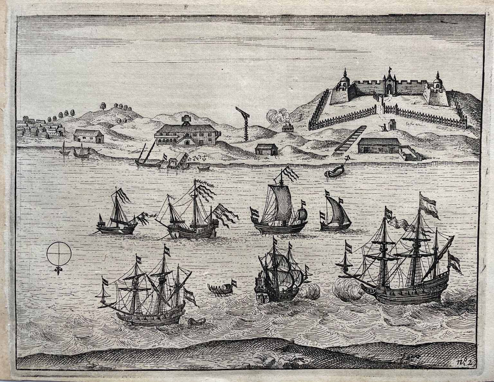
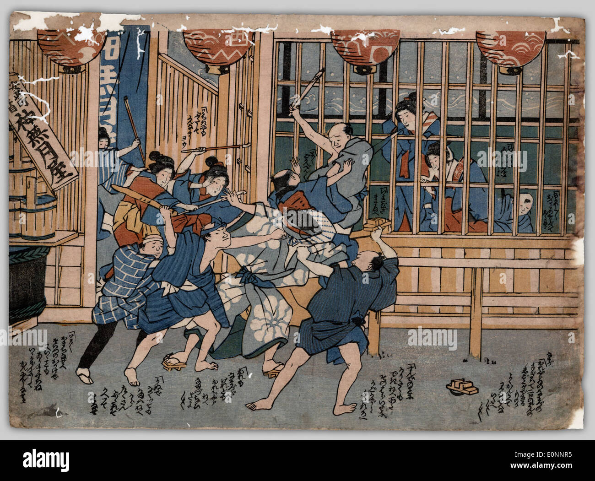

# 하마다 야효에 (浜田弥兵衛)

에도 초기 나가사키 거점 주인선 선장. 1628년 대만에서 [[타이오완_사건|나위츠 납치 사건]]을 일으킨 주인공. 외세의 무역 독점에 맞서 일본-VOC 교역 조건을 바꾼 인물로 재평가받아 1915년 종5위 추증.

---

## 기본 정보

| 항목 | 내용 |
|------|------|
| 한자 | 浜田弥兵衛 |
| 생몰년 | 미상 |
| 출신 | 나가사키 |
| 직함 | 주인선(朱印船) 선장 |
| 소속 | [[스에쓰구_헤이조]] 상단 |
| 사건 | [[타이오완_사건]] (1628) |
| 추증 | 종5위, 1915년(다이쇼 4년) |

---

## 배경: 나가사키와 스에쓰구 가문

하마다 야효에는 나가사키 대관 **스에쓰구 헤이조(末次平蔵, ?~1630)**의 부하 선장으로, 타이오완(대만) 경유 명나라 무역에 종사했다. 스에쓰구 가문은 1571년 나가사키 개항 이래 100년 이상 그 항구의 상업을 지배해 온 유력 가문이었다.

대만-일본 항로는 원래 중국인 수장 **[[이단|리단(李旦)]]**이 지배했으나, 그가 1625년 사망한 뒤 스에쓰구 헤이조와 히라노 도지로의 손으로 넘어왔다.

---

## 연표

| 연도 | 행적 |
|------|------|
| 1625 | 타이오완 도착, VOC 관세 납부 거부 → 화물 압수, 일본 상선 통상 금지 |
| 1627 | 원주민 16명을 "고산국 사절단"으로 위장해 에도 귀환 → [[피테르_노위츠]] 쇼군 접견 저지 |
| 1628.6 | 노위츠의 보복(원주민 체포·선박 압수) → 단도로 노위츠 납치·감금 |
| 1628 | 나가사키 귀환 후 스에쓰구가 네덜란드 인질 구금, 히라도 상관 폐쇄 |
| 이후 | 행적 불명 |
| 1915 | 일본 정부 종5위 추증 |

---

## 1627년 원주민 외교 작전

하마다는 대만 원주민 16명을 "고산국(高山国)에서 온 사절단", 즉 대만 전역을 일본 쇼군에게 바치러 온 사신으로 소개하는 **상징 외교**를 펼쳤다. 이 퍼포먼스는 대만이 이미 일본 영향권 아래 있음을 공표하는 동시에, VOC 대사 노위츠의 쇼군 이에미쓰 접견을 원천 차단하는 효과를 냈다.

---

## 1628년 납치 사건

> 상세 내용 → [[타이오완_사건]]

1628년 6월, 노위츠의 선제 강경 대응(화물·선박·무기 전면 압수)에 맞서 하마다는 **단도를 들이대고 노위츠를 집무실에서 직접 납치**했다. 약 500명의 일본 '모험가'들이 질란디아 요새를 장악하는 시위를 벌이며 배상을 요구했다.

나가사키 도착 후 스에쓰구 헤이조가 협상 합의를 파기하고 네덜란드 인질들을 구금함으로써 사태는 외교 위기로 확대되었다.

---

## 역사적 유산

이 사건은 역설적으로 VOC가 막부에게 **한없이 유순한 파트너**임을 증명하는 계기가 되었다. VOC는 자사 총독을 스스로 막부에 볼모로 인도했고, 이 태도가 **쇄국 이후 유일한 유럽 무역국 지위**를 확보하는 발판이 되었다.

- 1915년 일본 정부 종5위 추증
- 대만 식민지 시기 타이난 안핑 고보(安平古堡, 구 질란디아 요새) 내 비석 건립
- 미에현 가메야마시에 기념비 및 후손 하마다 겐고 동상
- 모리시마 추료(1787, 《홍모잡화》)에 우키요에 풍 묘사로 기록

---

## 관련 인물 및 사건

- [[타이오완_사건]] — 1628년 납치 사건 전모
- [[스에쓰구_헤이조]] — 직속 상관, 나가사키 대관; 나가사키 귀환 후 합의 파기 당사자
- [[pieter-nuyts|피테르 노위츠]] — 납치 대상, VOC 대만 총독
- [[francois-caron|프랑수아 카론]] — 노위츠 석방을 이끌어낸 VOC 외교관
- [[shuinsen|주인선 제도]] — 하마다가 종사한 막부 허가 무역선 제도
- [[마카오_전투]] — VOC의 대만 진출 직접 배경
- [[VOC_마카오_패전]] — VOC 동아시아 전략 전환 맥락

---

## 이미지 자료

*Fort Zeelandia, Taiwan — 사건의 무대*

*우키요에 풍 묘사 (모리시마 추료, 1787)*
