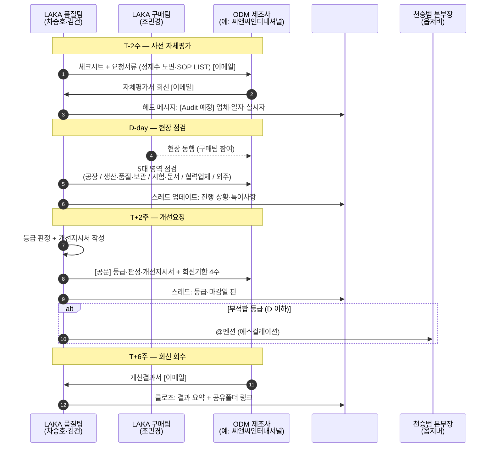
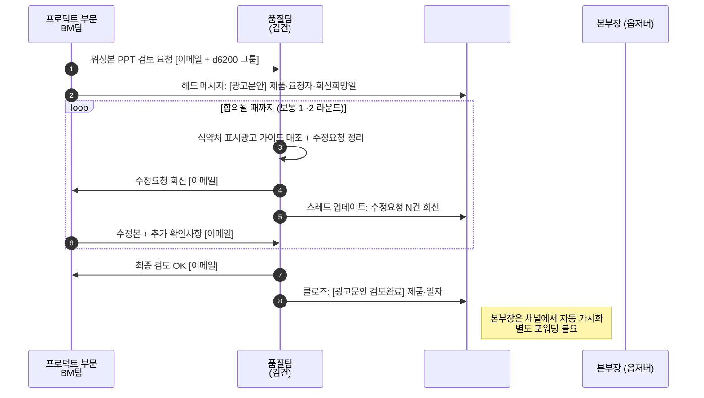
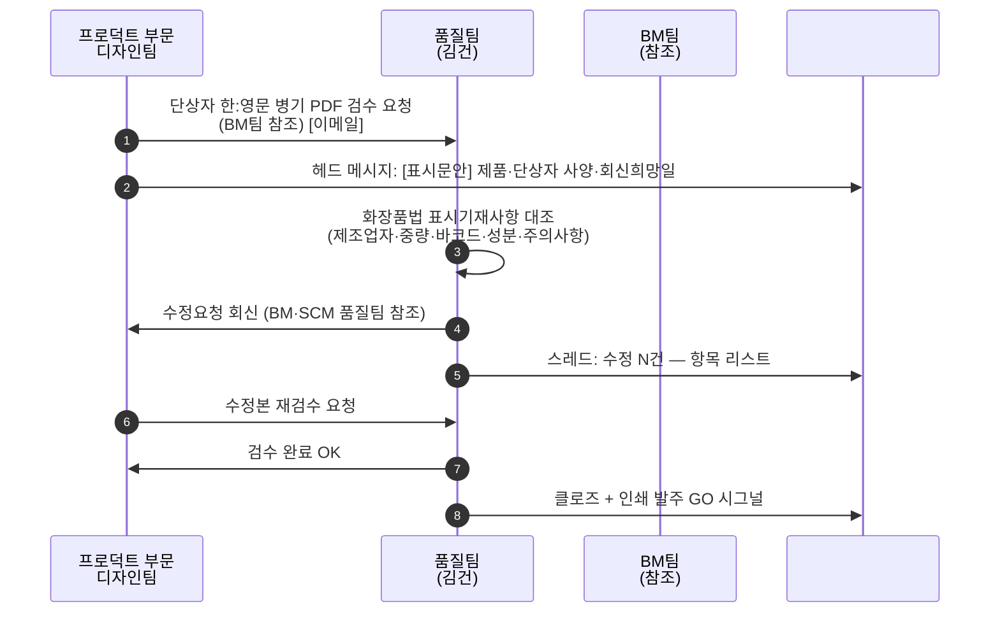
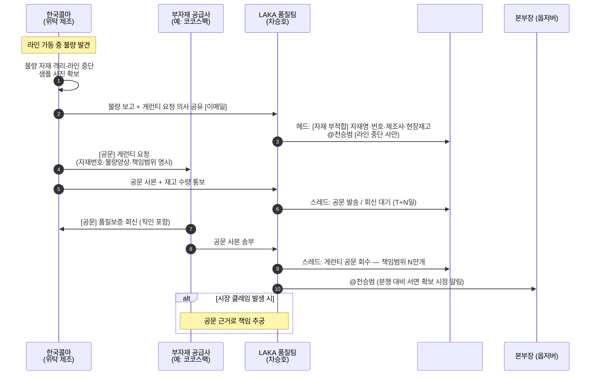

# 품질팀 업무 프로세스 도식

> **목적**: 천승범 본부장이 5/20 받은 4건의 진행 중 케이스를 기반으로, 품질팀이 실제로 수행하는 4종 업무 워크플로를 시퀀스 도식으로 정리.
> **사용처**: [[품질팀_슬랙채널_규칙_2026-05]] 의 각 채널 운영 룰의 근거.
> **근거 케이스(2026-05-20 본부장 일괄 포워딩 4건)**:
> - 씨앤씨인터내셔널 Audit 개선요청 (차승호, 2026-04-27 ~ 2026-05-29)
> - 매직립픽서 상세페이지 광고문안 워싱본 검토 (김건 ↔ BM팀 최민녕, 2026-05-14 ~ 2026-05-19)
> - 매직립픽서 단상자 표시문안 검수 (김건 ↔ 디자인팀 박다빈, 2026-04-24)
> - LAK-PGTT 용기 부자재 게런티 공문 (차승호·한국콜마·코코스팩, 2026-05-07 ~ 2026-05-18)

---

## 1. 워크플로 카탈로그

4건 케이스에서 식별된 4종 업무. R&R 매핑은 [[품질팀_슬랙운영_초안_2026-05]] 22개 R&R 기준.

| # | 워크플로 | 트리거 | 외부 관여 | 매핑 채널 | R&R |
|---|---------|--------|-----------|-----------|-----|
| A | ODM 정기/신규 Audit | 품질팀 자체 (사이클) | 제조사 직접 | `#qa-제조업체-audit` | #13 |
| B | 광고문안 (워싱본) 검토 | BM팀 → 품질팀 | 없음 (전 과정 내부) | `#qa-신제품-출시검증` | #15 |
| C | 표시문안 (단상자) 검수 | 디자인팀 → 품질팀 | 없음 (전 과정 내부) | `#qa-신제품-출시검증` | #4 |
| D | 부자재 게런티 / 부적합 | 위탁제조 / 공급사 (불량 발생) | 한국콜마 + 부자재 공급사 | `#qa-클레임-품질이슈` | #11 |

---

## 2. 워크플로 A — ODM 제조사 Audit

### 단계 요약

| 단계 | 일정(상대) | 담당 | 산출물 |
|------|-----------|------|--------|
| 1. 사전 자체평가 요청 | T-2주 | 차승호 | 체크시트, 정제수 도면·SOP LIST 요청 공문 |
| 2. 현장 점검 (5대 영역) | D-day (반일) | 차승호·김건 (품질) + 조민경 (구매) | 현장 점검 노트 |
| 3. 등급 판정 + 개선지시서 작성 | T+2주 | 차승호 | 평가등급(A~D), 개선지시서 (.pptx + .doc) |
| 4. 개선요청 공문 발송 | T+2주 | 차승호 | 개선요청 공문 (회신기한 4주 명시) |
| 5. 개선결과서 회신 회수 | T+6주 | 차승호 | 제조사 개선결과서 |
| 6. 클로즈 | T+6~8주 | 차승호 | 공유폴더 보관, 다음 사이클 등록 |

### 시퀀스

### 케이스 검증 — 씨앤씨인터내셔널 (2026)

| 단계 | 실제 일자 | 비고 |
|------|---------|------|
| 1. 사전 자체평가 요청 | 2026-04-27 | 요청서류: 정제수 도면, SOP LIST |
| 2. 현장 점검 | 2026-04-30 10:00 | 실시: 차승호·김건·조민경 / 실제 제조소: 화성코스메틱(주) |
| 3~4. 개선지시 발송 | 2026-05-15 | A등급, 거래가능 판정 |
| 5. 회신 마감 | **2026-05-29 (금)** | 본부장 모니터링 포인트 |

---

## 3. 워크플로 B — 광고문안 워싱본 검토

### 단계 요약

| 단계 | 담당 | 산출물 |
|------|------|--------|
| 1. 워싱본 PPT 검토 요청 | BM팀 (요청자) | 워싱 1차안 PPT |
| 2. 식약처 표시광고 가이드 대조 | 김건 | 수정요청 항목 리스트 |
| 3. 수정요청 회신 | 김건 | 수정요청 반영 PPT |
| 4. (수정·재검토 1~2 라운드) | BM ↔ 김건 | 수정본 PPT |
| 5. 최종 검토 OK | 김건 | 검토완료 통보 |

### 시퀀스

### 케이스 검증 — 매직립픽서 상세페이지 (2026)

| 단계 | 실제 일자 |
|------|---------|
| 1. 검토 요청 (BM 최민녕) | 2026-05-14 14:33 |
| 2. 수정요청 회신 (김건) | 2026-05-18 17:21 |
| 3. 수정본 회신 (BM) | 2026-05-19 14:45 |
| 4. 최종 검토 회신 (김건) | 2026-05-19 16:42 |
| 5. 본부장 포워딩 | 2026-05-20 09:56 |

**용어 메모**: "워싱본" = 화장품 광고 문구를 식약처 표시광고 가이드 기준으로 정제(washing)한 안. 광고 일러스트 디자인 직전 단계.

---

## 4. 워크플로 C — 표시문안 (단상자) 검수

### 단계 요약

| 단계 | 담당 | 산출물 |
|------|------|--------|
| 1. 단상자 문안 검수 요청 | 디자인팀 (요청자) | 한:영문 병기 PDF |
| 2. 화장품법 표시기재사항 대조 | 김건 | 수정요청 항목 |
| 3. 수정요청 회신 | 김건 | 정정 항목 통보 (제조업자·중량·바코드 등) |
| 4. 수정본 재검수 | 디자인팀 → 김건 | 수정 PDF |
| 5. 검수 완료 OK = 인쇄 발주 GO | 김건 | 검수완료 통보 |

### 시퀀스

### 케이스 검증 — 매직립픽서 단상자 (2026)

| 단계 | 실제 일자 | 수정 항목 |
|------|---------|-----------|
| 1. 검수 요청 (디자인 박다빈) | 2026-04-24 14:02 | PDF 52.62MB (대용량 첨부) |
| 2. 수정요청 회신 (김건) | 2026-04-24 17:00 | 3건 — 제조업자(한국콜마 부천공장) / 중량(0.03→0.13 oz) / 바코드 추가(8809611869608) |
| 3. 본부장 포워딩 | 2026-05-20 09:57 | — |

**용어 메모**: "검수"(B 검수) ≠ "검토"(B 검토).
- 검수 = 단상자·라벨의 **법령 표시기재사항** (제조업자·성분·중량 등) 정확성 점검
- 검토 = 광고 문구의 **표시광고 가이드 부합성** 점검

→ 같은 제품(매직립픽서)에도 두 워크플로가 모두 흐름. 두 건은 채널은 동일(`#qa-신제품-출시검증`)하지만 스레드 별개로 운영.

---

## 5. 워크플로 D — 부자재 게런티 / 부적합

### 단계 요약

| 단계 | 담당 | 산출물 |
|------|------|--------|
| 1. 불량 발견 → 라인 격리 | 한국콜마 (위탁제조) | 불량 보고서, 샘플 사진 |
| 2. LAKA 통보 | 한국콜마 → 차승호 | 불량 보고 이메일 |
| 3. 게런티 요청 공문 발송 | 한국콜마 → 부자재 공급사 | 공문 (자재번호·불량양상·책임범위·서면회신 요청) |
| 4. 재고 수량 확정 통보 | 한국콜마 → 부자재 공급사 | 보유·현장 수량 |
| 5. 게런티 공문 회신 | 부자재 공급사 → LAKA + 한국콜마 | 품질보증 공문 (직인 포함) |
| 6. 시장 클레임 발생 시 | (조건부) | 공문 근거로 책임 추궁 |

### 시퀀스

### 케이스 검증 — LAK-PGTT 용기 게런티 (2026)

| 단계 | 실제 일자 | 비고 |
|------|---------|------|
| 1~2. 불량 발견·보고 | (2026-05-07 이전) | 자재번호 51131543 / 자재명 LAK-PGTT 용기(코코스팩)공용 / 넥부 결손·융착 불량 → 라인 중단 |
| 3. 게런티 요청 공문 | 2026-05-07 11:50 | 한국콜마 문해진 → 코코스팩 함상균 |
| 4. 재고 수량 통보 | 2026-05-07 13:29 | 보유 142,103 EA / 현장 39,010 EA |
| 5. 게런티 회신 공문 | 2026-05-18 17:10 | 코코스팩 → LAKA·한국콜마 (완제품 3만개 품질보증, 직인 누락 정정 재발송) |
| 6. 본부장 포워딩 | 2026-05-20 09:49 | — |

**3사 협업 구조 메모**: 본 워크플로는 LAKA가 **직접 공문 발신 주체가 아닌** 케이스. 한국콜마가 발신/회신 주체, LAKA는 참조 + 결과 회수·보관. 시장 클레임 대비 서면 확보가 핵심.

---

## 6. 미도식 워크플로 (오늘 케이스 없음, 향후 도식화 대상)

5채널 중 다음 2채널의 워크플로는 5/20 케이스에 없어 추후 사례 발생 시 보강.

- **`#qa-팀내`** — 내부 일상 조율 (특정 워크플로 없음)
- **`#qa-인허가-법규`** 의 워크플로
  - 식약처 정기보고 (원료·안전성·기능성심사면제) (R&R #5, #14)
  - 책임판매업자 변경등록·교육 (R&R #16, #17)
  - 개정법규 모니터링·자사 적용 (R&R #20, #21, #22)

---

## 7. 4종 워크플로 공통 패턴

오늘 4건을 관통하는 공통 구조:

1. **트리거 → 헤드 메시지 → 스레드 업데이트 → 클로즈** 4단 사이클
2. **외부 결과물(이메일/공문)은 이메일로 유지**, Slack은 내부 트래킹용
3. **본부장 옵저버**는 채널 멤버십으로 해결 (메일 포워딩 불요)
4. **에스컬레이션 트리거**는 워크플로별로 다름:
   - A: 부적합 등급
   - B: 식약처 가이드 위반 의심
   - C: 인쇄 발주 직전 사양 불일치
   - D: 라인 중단 발생 / 시장 클레임 회수 가능성

→ 이 4단 사이클과 에스컬레이션 트리거가 [[품질팀_슬랙채널_규칙_2026-05]] 의 핀고정 공지문에 박힘.

---

## 관련 위키

- [[품질팀_슬랙운영_초안_2026-05]] — 5채널 설계 + R&R 22개 매핑 원본
- [[품질팀_슬랙채널_규칙_2026-05]] — 본 도식 기반 5채널 핀고정 공지 + 운영 룰
- [[LAKA_조직도_2026-05]] — 품질전략 부문 천승범·차승호·김건 3인 구조
